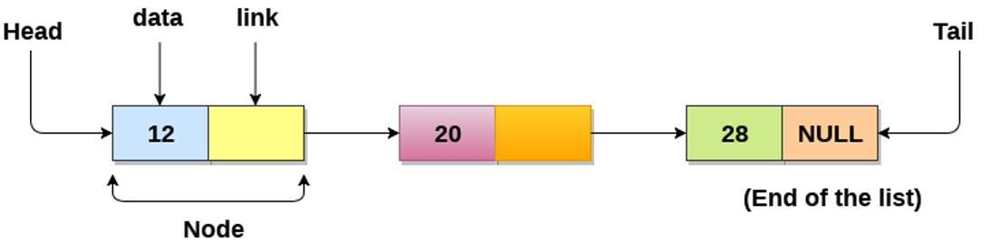

# Liked List

- One of the most fundamental data structures
- Store a collection of data items
- It consists of a sequence of nodes, each containing two references (links) pointing to the next and/or previous nodes
- Allows adding or deleting nodes at any point
- Allows sequential access
- Many other structures are based on a linked list
- A linked list can be defined as a collection of objects called nodes that are randomly stored in the memory.

<br>
<p align="center">
  
</p>

---
## Pointer

**Pointer** is used to point to the address of the values stored anywhere in the computer memory. It improves the performance of repetitive processes such as:
- Traversing a string
- Control Tables
- Lookup Tables
- Tree structure

#### Syntax:

```
datatype *variable_name;
```
or 

```
datatype* variable_name;
```

#### For example:

```
float *ptrX;
```

There are several types of linked Lists used by programmers.

- Singly Linked List
- Doubly Liked List
- Circular liked List
- Circular Doubly Linked List

---


