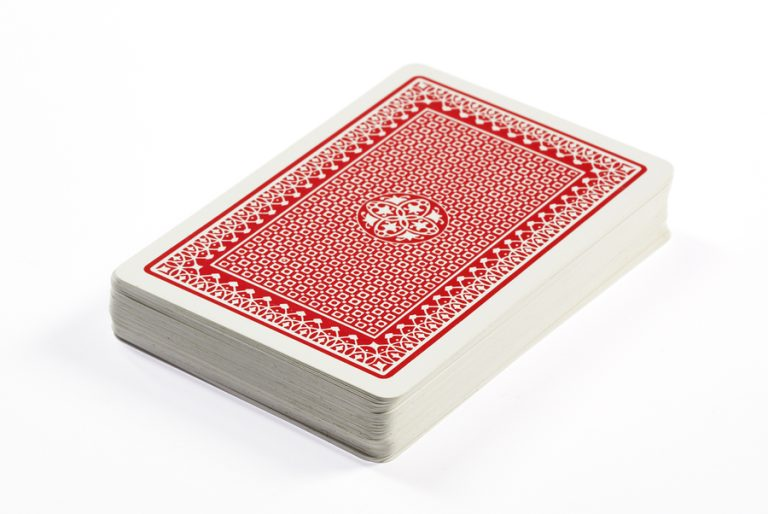

# Stack

A stack is an Abstract Data Type (ADT) commonly used in most programming languages. 

---

## Real-world Examples

<table>
  <tr>
    <td align="center">
      <b>A deck of cards</b> 
      
    </td>
    <td align="center">
      <b>A pile of plates</b> 
      
    </td>
  </tr>
</table>

---

## Operations on stack

### push()
Push (store) an element on the stack.

### pop()
Remove (access) an element from the stack.

#### To use the stack efficiently, we need to check the status of the stack as well. 

### peak()
Gets the element at the top of the stack without removing it.

### isfull()
Check if the stack is full.

### isempty()
Check if the stack is empty.
When the stack is empty, the top becomes (-1).

- When the stack is full, the push operation is done. It gives a **Stack Overflow** condition.
- When the stack is empty, the pop operation is done. It gives a **Stack underflow** condition.

---

## Applications of Stack

- Recursion
- Expression evaluation and conversion
- Parsing
- Editors
- Tree traversals
- Browsers

 
